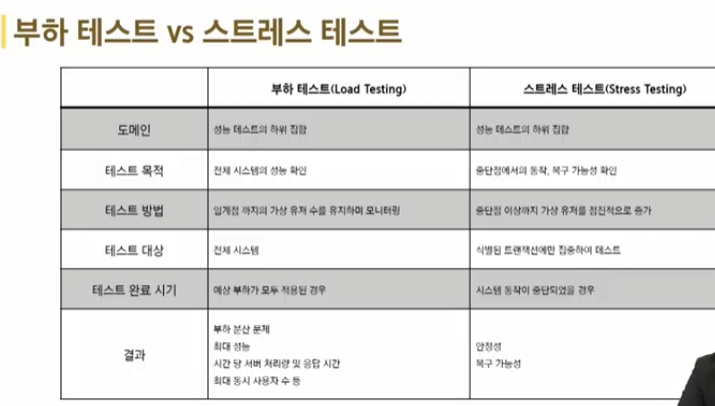
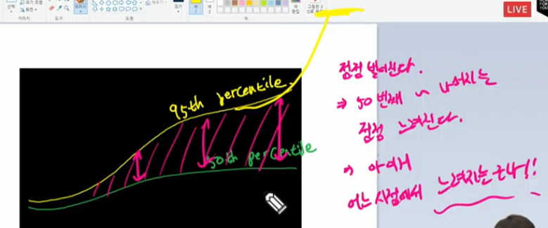

## Locust

### 테스트
- 원하는 기능이 모두 구현되었는지 확인하고 숨겨져 있는 결함을 찾는 활동
- 여러가지 도구들을 활용하여 버그를 찾아내고 신뢰성, 보안, 성능 등을 검증하는 중요한 단계
- 상황에 맞게 필요한 테스트를 진행한다 

### 성능 테스트
- 핵심적인 테스트 중 하나
- 특정 상황에서 시스템이 어느정도 수준을 보이는가 혹은 어떻게 대처를 하는가를 테스트하는 과정
- 목적 
    - 여러테스트를 통해 서은ㅇ저하가 발생하는 요인을 발견하고 제거
    - 시장에 출시되기 전에 발생할 수 있는 위험과 개선사항을 파악
    - 안정적이고 신뢰할 수 있는 제품을 빠르게 만들기 위함

### 부하 테스트
- 시스템에 임계점의 부하가 계속될 때 문제가 없는가?
- 목적 : 시스템의 신뢰도와 성능을 측정
- 임계점 : 사용자 혹은 요청이 점점 늘어나다가, 응답시간이 급격히 느려지는 시점

### 스트레스 테스트
- 시스템에 과부하가 오면 어떻게 동작할까
- 목적: 장애 조치와 복구 절차가 효과적이고 효율적인지 확인

---

## API 성능 테스트

### Locust
- 오픈 소스 부하테스트 도구
- 내가 만든 서버에 수많은 사용자들이 동시에 들어올 때 어떤 일이 벌어지는지 확인하는 부하테스트를 할수 있는 도구
- 파이썬 언어로 테스트 시나리오를 작성 가능
- 결과를 웹에서 확인할 수 있는 UI 지원
- JMeter 테스트 도구도 있음

### 사용법
1. 테스트 스크립트 작성하기 (공식문서 참조)
- HttpUser : http 요청을 만드는 가상 유저
- wait_time : 작업 간 대기 시간
- on_start() : 가상 유저 생성 시 실행
- @task : 유저가 실행할 작업
- @task(N) : 가중치 (실행확률) - N만큼 높은 확률로 작업을 수행
- self.client.get : HTTP GET 요청 전송

가중치가 3이라면 1:3의 확률로 실행됨

2. 실제 테스트 해보기

병목현상 발생

3. 통계 퍼센타일
50% -> 절반
90% -> 대략적인 나머지  
95% -> 
99% -> 1% 예외 상황  

---

## 정렬 알고리즘 테스트
### 주의사항
- 오늘 테스트는 정석적인 방법과는 거리가 있음
    - 정식 : 서버에 배포된 API 또는 프로그램에 부하테스트를 해야 한다
- 하지만 현재는 PC에서 작동중인 서버로 요청을 보내는 것
    - pc의 성능에 따라 결과가 매우 달라짐
    - 현재 서버가 작동중인 PC에서 테스트를 진행하므로 테스트중 다른 조작을 하지말아야 함

### 정렬 알고리즘 구현하기
- 대상
    1. 파이썬 내장 정렬함수 - O(N log N)
    2. 버블 정렬 - O(n^2)
    3. 우선순위 큐 - 삽입 O(logN), 삭제 O(logN)

### 테스트 스크립트 작성하기
1. 모든 태스크를 주석처리 함
    - 태스크를 하나씩만 주석을 풀어 활성화 시킨다
2. 로커스트를 실행한다
3. 결과를 웹에서 확인
4. 테스트가 끝난 타스크를 주석처리 후 다음 테스트 타스크 풀어 활성화 

### 테스트 결과 python 빌트인 소트
- 랜덤 배열 크기 1000 랜덤 범위 5000 동시 사용자 500 동시 접속자 20
- 평균 RPS : 212.0
- 응답시간 : 모든 응답이 0.6초 이내
- 시작할 땐 병목이 발생하지만 곧 해결
- 결론 : 사용자 수가 늘어날 때만 제외하고 안정적

